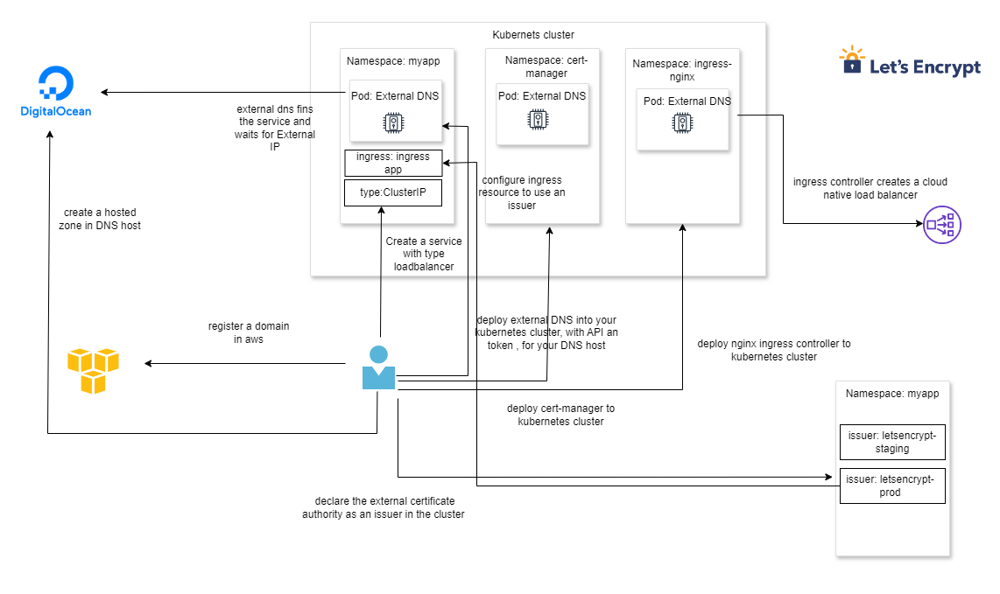

### cert manager documentation
    https://cert-manager.io/docs/installation/kubectl/

### install cert manager 
    kubectl apply -f https://github.com/cert-manager/cert-manager/releases/download/v1.16.1/cert-manager.yaml

### verify cert manager
    kubectl get all -n cert-manager

### Verify Cert Manager Pod Logs
    kubectl get pods -n cert-manager
    kubectl logs -f cert-manager-55d65894c7-sx62f -n cert-manager

### end 
    kubectl describe certificate
    kubectl describe certificaterequest 
    kubectl describe order   
    kubectl describe challenge
    kubectl get certificate 
    kubectl get certificaterequest

## Architecture diagram (ingress)

### Deploy Cluster Issuer
    kubectl apply -f cluster-issuer.yml

### List Cluster Issuer
    kubectl get clusterissuer