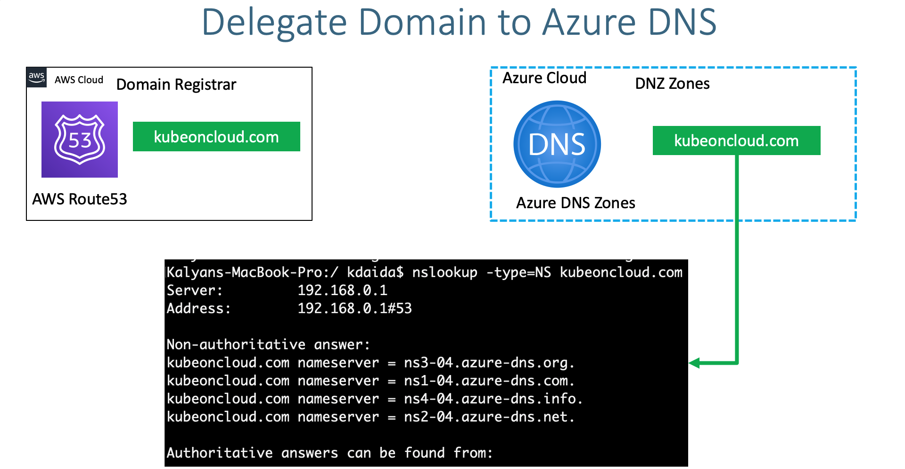

## Azure DNS allows to host a DNS zone and manage the DNS records for a domain in Azure
### eg :- Register domain in AWS Route53 and host in azure hosted zones

## DNS Architecture

## Domain Register
    register domain in AWS Route53
## Create Azure DNS Zones
    Go to Service -> DNS Zones
    Subscription: kubeoncloud-Paid-Subscription (need to have a paid subscription for this)
    Resource Group: dns-zones
    Name: kubeoncloud.com
    Resource Group Location: East US
    Click on Review + Create

## Azure nameservers
    Go to Services -> DNS Zones -> kubeoncloud.com
    ns1-04.azure-dns.com.
    ns2-04.azure-dns.net.
    ns3-04.azure-dns.org.
    ns4-04.azure-dns.info.

##  update nameservers at domain provider (AWS Route53)
### Verify before updation
        nslookup -type=SOA kubeoncloud.com
        nslookup -type=NS kubeoncloud.com
    Go to AWS Route53 (Domain Provider)
    Go to Services -> Route53 -> Registered Domains -> kubeoncloud.com
    Click on Add or edit name servers
    Update Azure Name servers here and click on Update
    Click on Hosted Zones
    Delete the hosted zone with name kubeoncloud.com
### Verify after updation
    nslookup -type=SOA kubeoncloud.com 8.8.8.8
    nslookup -type=NS kubeoncloud.com 8.8.8.8