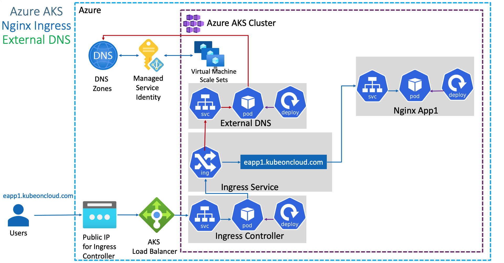

## External DNS Architecture

##  Azure Managed Service Identity (MSI)

### To get Azure Tenant ID
    az account show --query "tenantId"

### To get Azure Subscription ID
    az account show --query "id"

## Create MSI - Managed Service Identity for External DNS to access Azure DNS Zones

### Create Manged Service Identity (MSI)
    Go to All Services -> Managed Identities -> Add
    Resource Name: aksdemo1-externaldns-access-to-dnszones
    Subscription: Pay-as-you-go
    Resource group: aks-rg1 (aks cluster resource group)
    Location: Central US
    Click on Create

### Add Azure Role Assignment in MSI
    Opem MSI(Managed Identities) -> aksdemo1-externaldns-access-to-dnszones
    Click on Azure Role Assignments -> Add role assignment
    Scope: Resource group
    Subscription: Pay-as-you-go
    Resource group: dns-zones
    Role: Contributor

### Client Id and update in azure.json
    Go to Overview(Managed Identities) -> Make a note of **Client ID"
    Update in azure.json value for userAssignedIdentityID

    "userAssignedIdentityID": "de836e14-b1ba-467b-aec2-93f31c027ab7"

## Associate MSI in AKS Cluster VMSS
    Go to All Services -> Virtual Machine Scale Sets (VMSS) -> Open aksdemo1 related VMSS (aks-agentpool-27193923-vmss)
    Go to Settings -> Identity -> User assigned -> Add -> aksdemo1-externaldns-access-to-dnszones

## Create Kubernetes Secret and Deploy ExternalDNS
### Create Secret
    kubectl create secret generic azure-config-file --from-file=azure.json

### List Secrets
    kubectl get secrets

### Deploy ExternalDNS 
    cd kube-manifests/01-ExteranlDNS
    kubectl apply -f external-dns.yml

### Verify ExternalDNS Logs
    kubectl logs -f $(kubectl get po | egrep -o 'external-dns[A-Za-z0-9-]+')

### Deploy Application
    kubectl apply -f deployment.yml
    kubectl apply -f ingress.yml

### Verify Pods and Services
    kubectl get po,svc

### Verify Ingress
    kubectl get ingress

### Verify ExternalDNS Logs
    kubectl logs -f $(kubectl get po | egrep -o 'external-dns[A-Za-z0-9-]+')

### Verify Record Set in DNS Zones
    az network dns record-set a list -g dns-zones -z kubeoncloud.com
    nslookup app.kubeoncloud.com