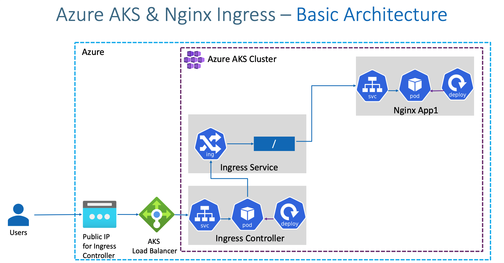

## Architecture diagram (ingress)

## create static publicIp
### Get the resource group name of the AKS cluster 
    az aks show --resource-group aks-rg1 --name aksdemo1 --query nodeResourceGroup -o tsv
### create static ip
    az network public-ip create --resource-group MC_aks-rg1_aksdemo1_centralus \
                                --name myAKSPublicIPForIngress \
                                --sku Standard \
                                --allocation-method static \
                                --query publicIp.ipAddress \
                                -o tsv

    seach public ip address in azure portal
    public ip: 52.154.156.139

## install ingress controller using helm
### Create a namespace for your ingress resources
    kubectl create namespace ingress-basic
    helm repo add ingress-nginx https://kubernetes.github.io/ingress-nginx
    helm repo update
    helm show values ingress-nginx/ingress-nginx
### Replace Static IP 
    helm install ingress-nginx ingress-nginx/ingress-nginx \
    --namespace ingress-basic \
    --set controller.replicaCount=2 \
    --set controller.nodeSelector."kubernetes\.io/os"=linux \
    --set defaultBackend.nodeSelector."kubernetes\.io/os"=linux \
    --set controller.service.externalTrafficPolicy=Local \
    --set controller.service.loadBalancerIP="52.154.156.139"     

    kubectl get pods -n ingress-basic
    kubectl get all -n ingress-basic

## List Pods
    kubectl apply -f deployment.yml
    kubectl apply -f ingress.yml
    kubectl get pods

## List Services
    kubectl get svc

## List Ingress
    kubectl get ingress

## Access Application
    http://<Public-IP-created-for-Ingress>

## ingress annotation
    https://kubernetes.github.io/ingress-nginx/user-guide/nginx-configuration/annotations/

## context type
    https://kubernetes.io/docs/concepts/services-networking/ingress/#path-types  