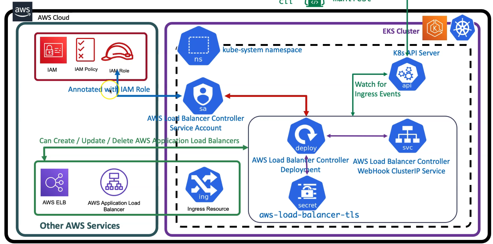

### DOCS
### iam loadbalancer controller policy
    https://github.com/kubernetes-sigs/aws-load-balancer-controller
### install aws-load-balancer-controller
    https://docs.aws.amazon.com/eks/latest/userguide/aws-load-balancer-controller.html
    https://docs.aws.amazon.com/eks/latest/userguide/add-ons-images.html
### ingress class
    https://kubernetes-sigs.github.io/aws-load-balancer-controller/v2.3/guide/ingress/ingress_class/
    https://kubernetes-sigs.github.io/aws-load-balancer-controller/latest/guide/ingress/ingress_class/
    https://kubernetes.io/docs/concepts/services-networking/ingress-controllers/
### helm
    https://helm.sh/docs/intro/install/
    https://docs.aws.amazon.com/eks/latest/userguide/helm.html

## Architecture diagram (Application Loadbalancer Controller)

### check eksctl and kubectl
    eksctl version
    kubectl version --short
    kubectl version

### installing kubectl cli
    https://docs.aws.amazon.com/eks/latest/userguide/install-kubectl.html

### installing or upgrading latest eksctl version
    https://docs.aws.amazon.com/eks/latest/userguide/eksctl.html

### create eks cluster and worker nodes
    eksctl create cluster --name=eksdemo1 \
                        --region=us-east-1 \
                        --zones=us-east-1a,us-east-1b \
                        --version="1.21" \
                        --without-nodegroup 

    eksctl get cluster   

    eksctl utils associate-iam-oidc-provider \
        --region us-east-1 \
        --cluster eksdemo1 \
        --approve

### Create EKS NodeGroup in VPC Private Subnets
    eksctl create nodegroup --cluster=eksdemo1 \
                            --region=us-east-1 \
                            --name=eksdemo1-ng-private1 \
                            --node-type=t3.medium \
                            --nodes-min=2 \
                            --nodes-max=4 \
                            --node-volume-size=20 \
                            --ssh-access \
                            --ssh-public-key=kube-demo \
                            --managed \
                            --asg-access \
                            --external-dns-access \
                            --full-ecr-access \
                            --appmesh-access \
                            --alb-ingress-access \
                            --node-private-networking      

### verify cluster, nodegroup,kubectl

    eksctl get cluster
    eksctl get nodegroup --cluster=eksdemo1
    eksctl get iamserviceaccount --cluster=eksdemo1

### Configure kubeconfig for kubectl
    aws eks --region us-east-1 update-kubeconfig --name eksdemo1

### Verify EKS Nodes in EKS Cluster using kubectl
    kubectl get nodes

### Verify using AWS Management Console
    EKS EC2 Nodes

## create iam policy
### aws loadbalancer controller git repo
    https://github.com/kubernetes-sigs/aws-load-balancer-controller

### Delete files before download (if any present)
    rm iam_policy_latest.json

### Download IAM Policy
### Download latest
    curl -o iam_policy_latest.json https://raw.githubusercontent.com/kubernetes-sigs/aws-load-balancer-controller/main/docs/install/iam_policy.json
### Verify latest
    ls -lrta 
### Download specific version
    curl -o iam_policy_v2.3.1.json https://raw.githubusercontent.com/kubernetes-sigs/aws-load-balancer-controller/v2.3.1/docs/install/iam_policy.json

### Create IAM Policy using policy downloaded 
    aws iam create-policy \
        --policy-name AWSLoadBalancerControllerIAMPolicy \
        --policy-document file://iam_policy_latest.json

### policy ARN
    Policy ARN:  arn:aws:iam::180789647333:policy/AWSLoadBalancerControllerIAMPolicy

### Create an IAM role for the AWS LoadBalancer Controller and attach the role to the Kubernetes service account
### Create IAM Role using eksctl with kubernets serviceaccount and assign the role to serviceaccount
    kubectl get sa -n kube-system
    kubectl get sa aws-load-balancer-controller -n kube-system

### create iamserviceaccount
    eksctl create iamserviceaccount \
    --cluster=eksdemo1 \
    --namespace=kube-system \
    --name=aws-load-balancer-controller \
    --attach-policy-arn=arn:aws:iam::180789647333:policy/AWSLoadBalancerControllerIAMPolicy \
    --override-existing-serviceaccounts \
    --approve

### Get IAM Service Account
    eksctl  get iamserviceaccount --cluster eksdemo1

### Verify CloudFormation Template eksctl created & IAM Role
    Goto Services -> CloudFormation
    CFN Template Name: eksctl-eksdemo1-addon-iamserviceaccount-kube-system-aws-load-balancer-controller
    Click on Resources tab
    Click on link in Physical Id to open the IAM Role
    Verify it has eksctl-eksdemo1-addon-iamserviceaccount-kube-Role1-WFAWGQKTAVLR associated

### verify aws serviceaccount
    kubectl get sa -n kube-system
    kubectl get sa aws-load-balancer-controller -n kube-system
    kubectl describe sa aws-load-balancer-controller -n kube-system

## Install AWS Load Balancer Controller (Helm)
### If deploying to any Region other than us-west-2, replacing account and region-code with the values for your region listed in    Amazon EKS add-on container image addresses.
### Region Account info
    https://docs.aws.amazon.com/eks/latest/userguide/add-ons-images.html
    --set image.repository=account.dkr.ecr.region-code.amazonaws.com/amazon/aws-load-balancer-controller

### Add the eks-charts repository.
    helm repo add eks https://aws.github.io/eks-charts

### Update your local repo to make sure that you have the most recent charts.
    helm repo update

### Install the AWS Load Balancer Controller.
    helm install aws-load-balancer-controller eks/aws-load-balancer-controller \
    -n kube-system \
    --set clusterName=eksdemo1 \
    --set serviceAccount.create=false \
    --set serviceAccount.name=aws-load-balancer-controller \
    --set region=us-east-1 \
    --set vpcId=vpc-0165a396e41e292a3 \
    --set image.repository=602401143452.dkr.ecr.us-east-1.amazonaws.com/amazon/aws-load-balancer-controller

###  Verify that the controller is installed and Webhook Service created
### Verify that the controller is installed.
    kubectl -n kube-system get deployment 
    kubectl -n kube-system get deployment aws-load-balancer-controller
    kubectl -n kube-system describe deployment aws-load-balancer-controller

    kubectl -n kube-system get svc 
    kubectl -n kube-system get svc aws-load-balancer-webhook-service
    kubectl -n kube-system describe svc aws-load-balancer-webhook-service

### Verify Labels in Service and Selector Labels in Deployment
    kubectl -n kube-system get svc aws-load-balancer-webhook-service -o yaml
    kubectl -n kube-system get deployment aws-load-balancer-controller -o yaml
    Observation:
    1. Verify "spec.selector" label in "aws-load-balancer-webhook-service"
    2. Compare it with "aws-load-balancer-controller" Deployment "spec.selector.matchLabels"
    3. Both values should be same which traffic coming to "aws-load-balancer-webhook-service" on port 443 will be sent to port 9443 on "aws-load-balancer-controller" deployment related pods. 

    kubectl get pods -n kube-system
    kubectl -n kube-system logs -f  aws-load-balancer-controller-86b598cbd6-5pjfk
    kubectl -n kube-system logs -f aws-load-balancer-controller-86b598cbd6-vqqsk

### Verify AWS Load Balancer Controller k8s Service Account - Internals
    kubectl -n kube-system get sa aws-load-balancer-controller
    kubectl -n kube-system get sa aws-load-balancer-controller -o yaml
    kubectl -n kube-system get secret aws-load-balancer-controller-token-5w8th 
    kubectl -n kube-system get secret aws-load-balancer-controller-token-5w8th -o yaml
## Decoce ca.crt using below two websites
    https://www.base64decode.org/
    https://www.sslchecker.com/certdecoder

## Decode token using below two websites
    https://www.base64decode.org/
    https://jwt.io/
    Observation:
    1. Review decoded JWT Token

# List Deployment in YAML format
    kubectl -n kube-system get deploy aws-load-balancer-controller -o yaml
    Observation:
    1. Verify "spec.template.spec.serviceAccount" and "spec.template.spec.serviceAccountName" in "aws-load-balancer-controller" Deployment
    2. We should find the Service Account Name as "aws-load-balancer-controller"

# List Pods in YAML format
    kubectl -n kube-system get pods
    kubectl -n kube-system get pod aws-load-balancer-controller-65b4f64d6c-h2vh4 -o yaml
    Observation:
    1. Verify "spec.serviceAccount" and "spec.serviceAccountName"
    2. We should find the Service Account Name as "aws-load-balancer-controller"
    3. Verify "spec.volumes". You should find something as below, which is a temporary credentials to access AWS Services
    CHECK-1: Verify "spec.volumes.name = aws-iam-token"
    - name: aws-iam-token
        projected:
        defaultMode: 420
        sources:
        - serviceAccountToken:
            audience: sts.amazonaws.com
            expirationSeconds: 86400
            path: token
    CHECK-2: Verify Volume Mounts
        volumeMounts:
        - mountPath: /var/run/secrets/eks.amazonaws.com/serviceaccount
        name: aws-iam-token
        readOnly: true          
    CHECK-3: Verify ENVs whose path name is "token"
        - name: AWS_WEB_IDENTITY_TOKEN_FILE
        value: /var/run/secrets/eks.amazonaws.com/serviceaccount/token     

### Verify TLS Certs for AWS Load Balancer Controller - Internals 
### List aws-load-balancer-tls secret 
    kubectl -n kube-system get secret aws-load-balancer-tls -o yaml

# Verify the ca.crt and tls.crt in below websites
    https://www.base64decode.org/
    https://www.sslchecker.com/certdecoder

# Make a note of Common Name and SAN from above 
    Common Name: aws-load-balancer-controller
    SAN: aws-load-balancer-webhook-service.kube-system, aws-load-balancer-webhook-service.kube-system.svc

# List Pods in YAML format
    kubectl -n kube-system get pods
    kubectl -n kube-system get pod aws-load-balancer-controller-65b4f64d6c-h2vh4 -o yaml
    Observation:
    1. Verify how the secret is mounted in AWS Load Balancer Controller Pod
    CHECK-2: Verify Volume Mounts
        volumeMounts:
        - mountPath: /tmp/k8s-webhook-server/serving-certs
        name: cert
        readOnly: true
    CHECK-3: Verify Volumes
    volumes:
    - name: cert
        secret:
        defaultMode: 420
        secretName: aws-load-balancer-tls  

### Create IngressClass Resource
    kubectl apply -f ingressclass-resource.yml
    kubectl get ingressclass
    kubectl describe ingressclass my-aws-ingress-class