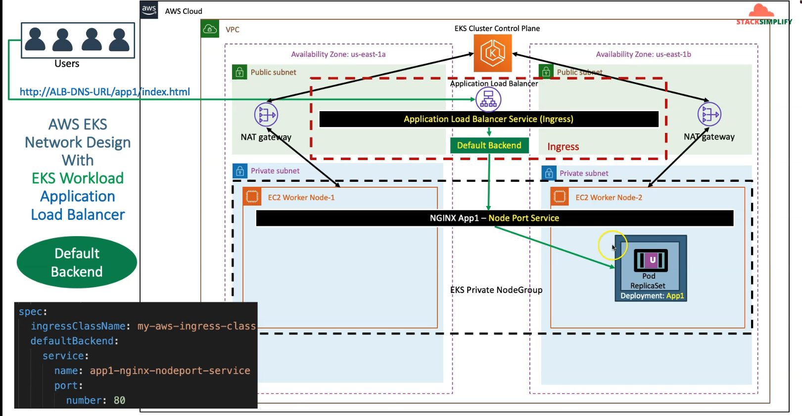
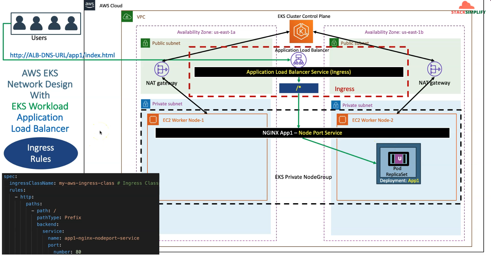
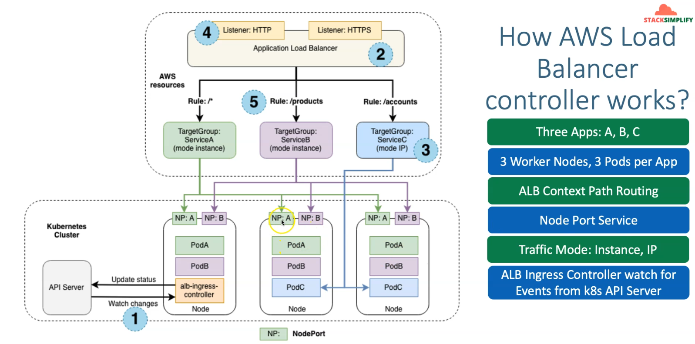

### docs
    https://kubernetes-sigs.github.io/aws-load-balancer-controller/latest/guide/ingress/annotations/
    https://kubernetes-sigs.github.io/aws-load-balancer-controller/latest/guide/ingress/ingress_class/
    https://kubernetes.io/docs/concepts/services-networking/ingress/#path-types
    https://kubernetes.io/blog/2020/04/02/improvements-to-the-ingress-api-in-kubernetes-1.18/#better-path-matching-with-path-types
    https://kubernetes.io/docs/concepts/services-networking/ingress/#the-ingress-resource

## Architecture diagram (Application Loadbalancer Controller)

## Architecture diagram (Application Loadbalancer Controller)

## Architecture diagram (Application Loadbalancer Controller)

## verify default ingress , rule base ingress
    kubectl apply -f default_ingress.yml / path_ingress.yml
    kubectl apply -f deployment.yml
    kubectl get deploy
    kubectl get pods
    kubectl get ingress
    kubectl describe ingress ingress-nginxapp1
    kubectl get svc

### Verify Application Load Balancer using 
    Goto AWS Mgmt Console -> Services -> EC2 -> Load Balancers
    1. Verify Listeners and Rules inside a listener
    2. Verify Target Groups

### Access App using Browser
    kubectl get ingress
    http://app1ingress-154912460.us-east-1.elb.amazonaws.com
    http://app1ingress-154912460.us-east-1.elb.amazonaws.com/app1/index.html

### Verify AWS Load Balancer Controller logs
    kubectl get po -n kube-system 
    kubectl -n kube-system logs -f aws-load-balancer-controller-65b4f64d6c-h2vh4
    kubectl -n kube-system logs -f aws-load-balancer-controller-65b4f64d6c-t7qqb