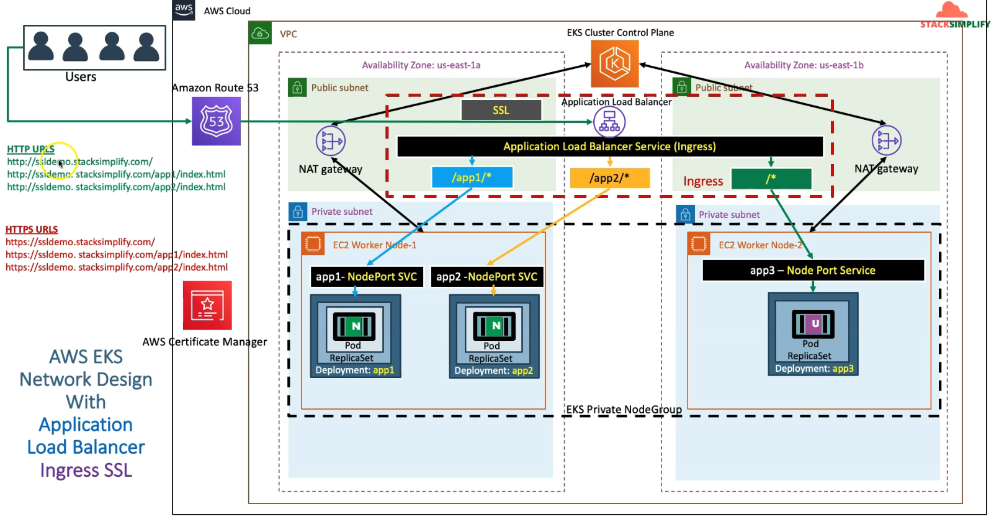

### docs
    https://kubernetes-sigs.github.io/aws-load-balancer-controller/v2.4/guide/ingress/annotations/

## Architecture diagram (Application Loadbalancer Controller)

### Register a Domain in Route53
    Goto Services -> Route53 -> Registered Domains
    Click on Register Domain
    Provide desired domain: kodeoncloud.com and click on check 
    Click on Add to cart and click on Continue
    Provide your Contact Details and click on Continue
    Enable Automatic Renewal
    Accept Terms and Conditions
    Click on Complete Order

### Create a SSL Certificate in Certificate Manager
    Go to Services -> Certificate Manager -> Create a Certificate
    Click on Request a Certificate
    Choose the type of certificate for ACM to provide: Request a public certificate
    Add domain names: *.kodeoncloud.com
    Select a Validation Method: DNS Validation
    Click on Confirm & Request
    - Validation (certificate validation)
        click on the created certificate request with pending status
        Click on Create record in Route 53
        Wait for 5 to 10 minutes and check the Validation Status

### add ssl annotations
    alb.ingress.kubernetes.io/listen-ports: '[{"HTTPS":443}, {"HTTP":80}]'
    alb.ingress.kubernetes.io/certificate-arn: arn:aws:acm:us-east-1:180789647333:certificate/632a3ff6-3f6d-464c-9121-b9d97481a76b

### Deploy kube-manifests
    kubectl apply -f deployment1.yml
    kubectl apply -f deployment2.yml
    kubectl apply -f deployment3.yml
    kubectl apply -f ingress.yml
    kubectl get ingress
    kubectl get deploy
    kubectl get pods
    kubectl get svc

### Add DNS in Route53
    Go to Services -> Route 53
    Go to Hosted Zones
    Click on kodeoncloud.com
    Create a Record Set
    Name: ssldemo101.kodeoncloud.com
    Alias: yes
    Alias Target: Copy our ALB DNS Name here
    Click on Create

### Access Application using newly registered DNS Name

### HTTP URLs
    http://ssldemo101.kodeoncloud.com/app1/index.html
    http://ssldemo101.kodeoncloud.com/app2/index.html
    http://ssldemo101.kodeoncloud.com/

### HTTPS URLs
    https://ssldemo101.kodeoncloud.com/app1/index.html
    https://ssldemo101.kodeoncloud.com/app2/index.html
    https://ssldemo101.kodeoncloud.com/

### clean up
    kubectl delete -f deployment1.yml
    kubectl delete -f deployment2.yml
    kubectl delete -f deployment3.yml
    kubectl delete -f ingress.yml
    - Delete Route53 Record  (ssldemo101.kodeoncloud.com)

### Add annotations related to SSL Redirect(on ssl-redirect-ingress.yml)
    alb.ingress.kubernetes.io/ssl-redirect: '443'   

### Deploy kube-manifests
    kubectl apply -f deployment1.yml
    kubectl apply -f deployment2.yml
    kubectl apply -f deployment3.yml
    kubectl apply -f ssl-redirect-ingress.yml
    kubectl get ingress
    kubectl get deploy
    kubectl get pods
    kubectl get svc

### Add DNS in Route53
    Go to Services -> Route 53
    Go to Hosted Zones
    Click on kodeoncloud.com
    Create a Record Set
    Name: ssldemo101.kodeoncloud.com
    Alias: yes
    Alias Target: Copy our ALB DNS Name here
    Click on Create

### Access Application using newly registered DNS Name

### HTTP URLs
    http://ssldemo101.kodeoncloud.com/app1/index.html
    http://ssldemo101.kodeoncloud.com/app2/index.html
    http://ssldemo101.kodeoncloud.com/

### HTTPS URLs
    https://ssldemo101.kodeoncloud.com/app1/index.html
    https://ssldemo101.kodeoncloud.com/app2/index.html
    https://ssldemo101.kodeoncloud.com/
