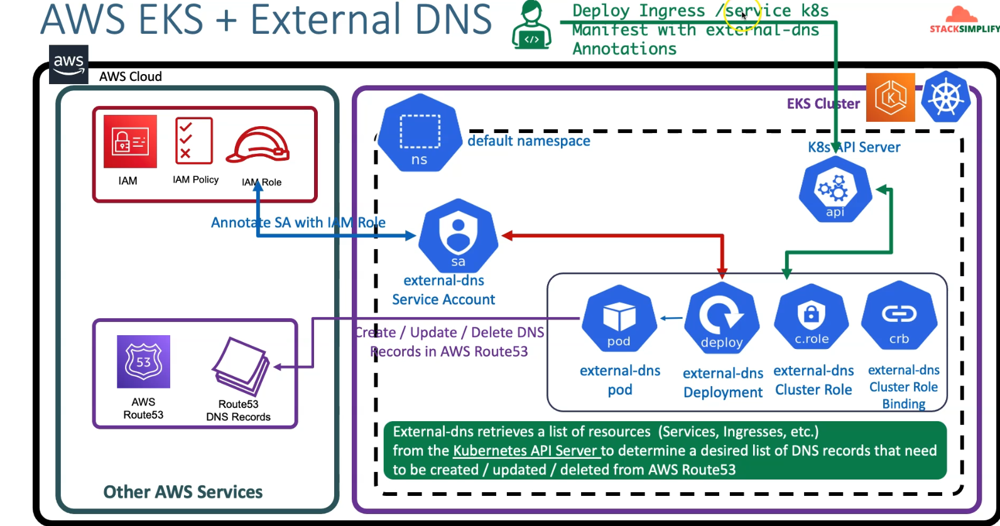

## Architecture diagram (Application Loadbalancer Controller)

### create iam policy
    IAM -> Policies -> Create Policy
    Click on JSON Tab and copy paste below JSON
    Click on Visual editor tab to validate
    Click on Review Policy
    Name: AllowExternalDNSUpdates
    Description: Allow access to Route53 Resources for ExternalDNS
    Click on Create Policy

### policy
    {
    "Version": "2012-10-17",
    "Statement": [
        {
        "Effect": "Allow",
        "Action": [
            "route53:ChangeResourceRecordSets"
        ],
        "Resource": [
            "arn:aws:route53:::hostedzone/*"
        ]
        },
        {
        "Effect": "Allow",
        "Action": [
            "route53:ListHostedZones",
            "route53:ListResourceRecordSets"
        ],
        "Resource": [
            "*"
        ]
        }
    ]
    }
## or
### Create IAM Policy using cli
    aws iam create-policy \
        --policy-name AllowExternalDNSUpdates \
        --policy-document file://iam_policy.json

### Policy ARN
    arn:aws:iam::180789647333:policy/AllowExternalDNSUpdates

### Create IAM Role, k8s Service Account & Associate IAM Policy
    eksctl create iamserviceaccount \
        --name external-dns \
        --namespace default \
        --cluster eksdemo1 \
        --attach-policy-arn arn:aws:iam::180789647333:policy/AllowExternalDNSUpdates \
        --approve \
        --override-existing-serviceaccounts

### Verify the Service Account
    kubectl get sa external-dns
    kubectl describe sa external-dns

### Verify CloudFormation Stack
    Go to Services -> CloudFormation
    Click on Resources tab
    Click on link in Physical ID field which will take us to IAM Role directly
    - Verify IAM Role & IAM Policy
        With above step in CFN, we will be landed in IAM Role created for external-dns.
        Verify in Permissions tab we have a policy named AllowExternalDNSUpdates
        make a note of that Role ARN will bee need to update in External-DNS k8s manifest

### Make a note of Role ARN
    arn:aws:iam::180789647333:role/eksctl-eksdemo1-addon-iamserviceaccount-defa-Role1-JTO29BVZMA2N

### verify iam serviceaccount using eksctl
    eksctl get iamserviceaccount --cluster eksdemo1

### Update External DNS Kubernetes manifest
### doc
    https://github.com/kubernetes-sigs/external-dns/blob/master/docs/tutorials/aws.md
    https://github.com/kubernetes-sigs/external-dns/releases/tag/v0.10.2 
    https://github.com/kubernetes-sigs/external-dns/blob/master/docs/tutorials/aws-load-balancer-controller.md
    https://github.com/kubernetes-sigs/external-dns/blob/master/docs/tutorials/aws.md

### Deploy ExternalDNS
    kubectl apply -f Deploy-ExternalDNS.yml
    kubectl get all
    kubectl get pods
    kubectl logs -f $(kubectl get po | egrep -o 'external-dns[A-Za-z0-9-]+')