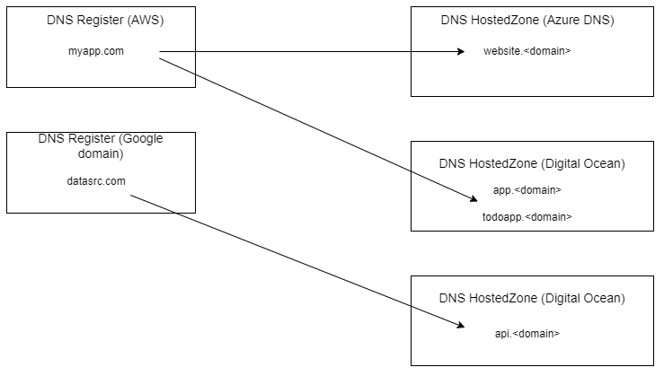
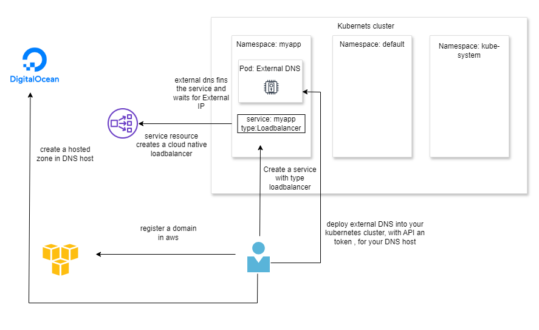
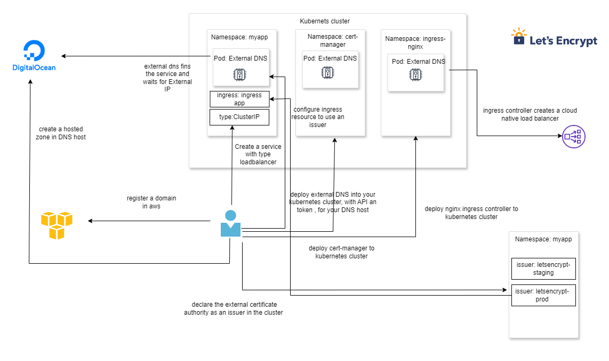

### external dns documantation
    https://github.com/kubernetes-sigs/external-dns
## DNS Register and DNS Hosts

## Architecture diagram (service)

## create namespace and switch to namespace
    kubectl apply -f namespace.yml
    kubens dns

## apply externel dns config (digitalocen)
    kubectl apply -f digital-ocen.yml

## apply service and deployment
    kubectl apply -f deployment.yml
    kubectl apply -f service.yml

## verify A Record 
    doctl compute domain records list myappshop.com 

## Architecture diagram (ingress)

